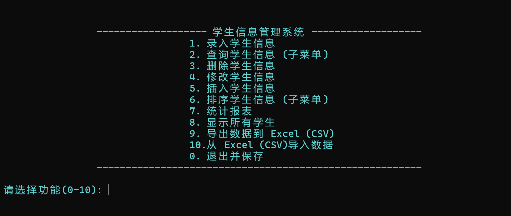
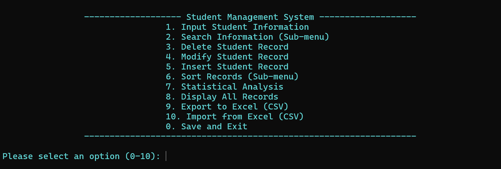

# Student-Management-System-Plus

### 📝 项目简介 | Introduction
**中文：** 一个基于 C 语言单链表实现，支持二进制存档与 CSV 导出功能的学生成绩管理系统。  
**English:** A Student Grade Management System implemented in C using linked lists, featuring binary data persistence and CSV export functionality.

> **🔥 New Update (2024.x.x):** > - Added full **Multi-language support**. You can now choose between the Chinese (`main.c`) and English (`main-EN.c`) versions.
> - 并排预览功能现已上线。

---

### 🖥️ 界面预览 | Interface Preview

| 中文版主界面 (Chinese) | 英文版主界面 (English) |
| :---: | :---: |
|  |  |

---

### ✨ 核心亮点 | Key Features
* **Double Storage Engine**: Supports both Binary (`.txt`) and CSV data formats.
* **Excel Compatibility**: Solves the "Scientific Notation" issue for long ID numbers in Excel.
* **Robust Logic**: Includes input validation (0-150 range) and duplicate ID checking.
* **User-Friendly UI**: Colored terminal interface for a better interaction experience.
* **Internationalization**: Full English source code and UI provided.

### 🚀 如何运行 | Quick Start
1. Clone the repository.
2. Choose your preferred version:
   - For Chinese: Compile `main.c`
   - For English: Compile `main-EN.c`
3. Use any C compiler (GCC/Clang/MSVC) to build and run the executable.

---
